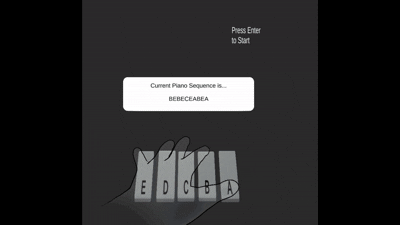
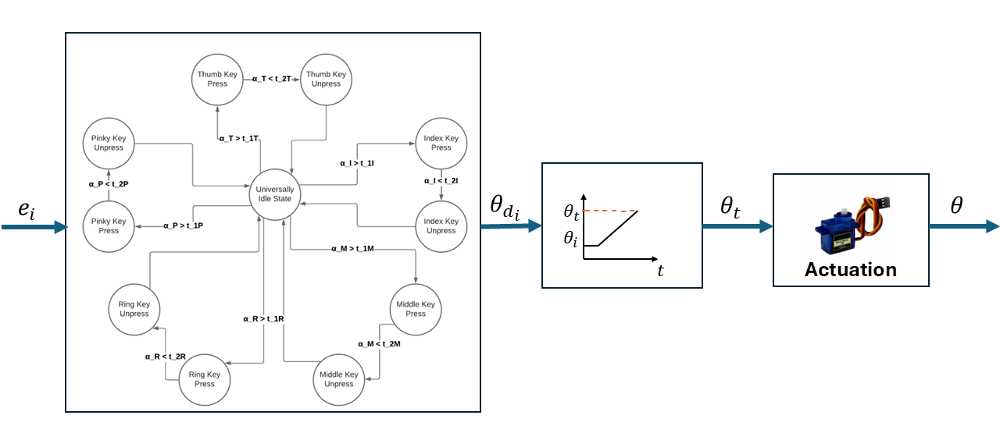
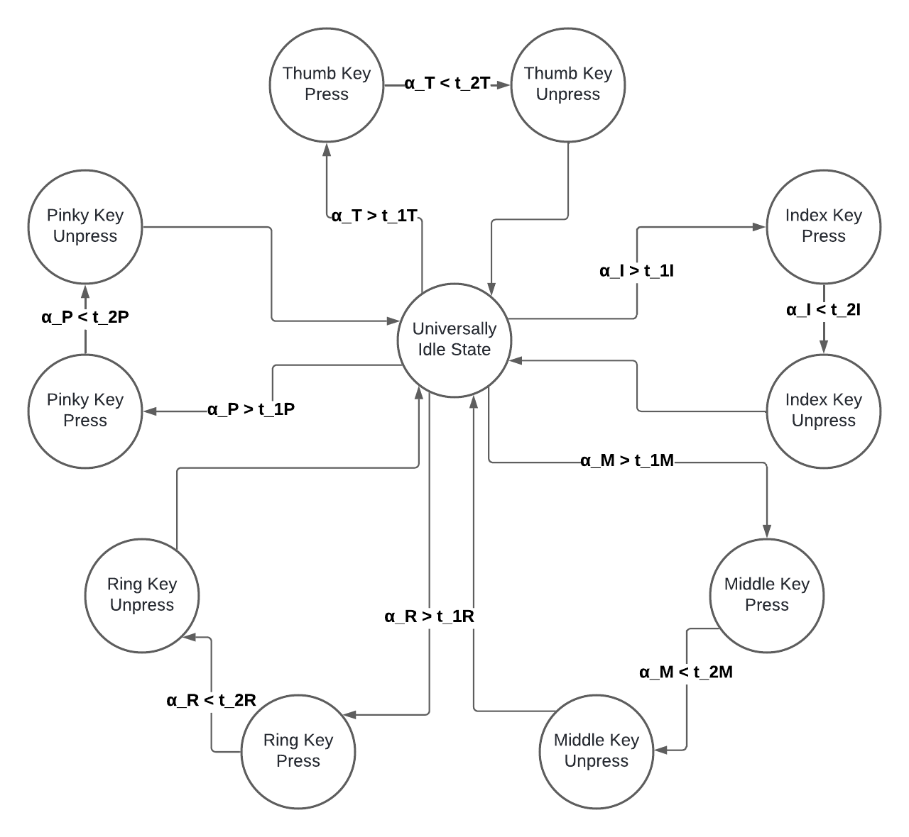
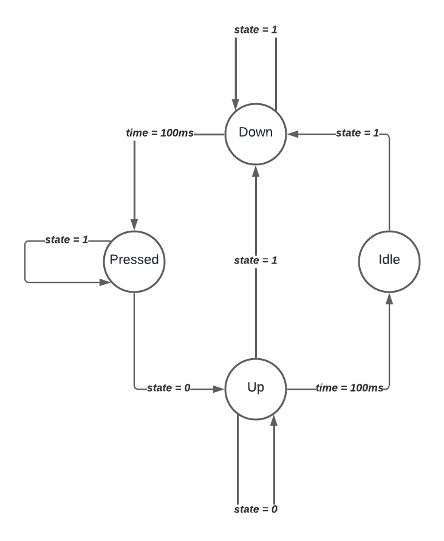

# STAR-eX: Student Teacher Assistive Rehabilitation Exoskeleton

## Introduction
This repository contains the code and documentation for the STAR-eX project (Student Teacher Assistive Rehabilitation Exoskeleton), inspired by Robotic Mirror Therapy (RMT), offering a cheap and portable alternative to other RMT devices on the market. The system combines a Leap Motion Controller, an Arduino-controlled 3D-printed parallel manipulator, and Unity to simulate and analyze hand movements while playing piano sequences. The primary goal of this project is to explore motor control and rehabilitation applications.

[Ultraleap Tracking Software](https://www.ultraleap.com) – Provides hand-tracking capabilities.

### System Overview

This project includes a Leap Motion Controller that tracks hand movements, a custom 3D-printed manipulator that moves the fingers, and Unity for simulation and testing purposes. The manipulator assists with both Active Mirror (AM) and Passive Mirror (P) conditions, as well as Kinesthetic (K) Therapy, offering a valuable tool for motor rehabilitation and control.

## Requirements
### Hardware
- **Leap Motion Controller** – A device that tracks hand motion.
- **3D-Printed Parallel Manipulator (RIGHT Hand)** – A robotic system to assist in finger movements. (Refer to the [GitHub repository](https://github.com/BerkeleyCurtis/EECS249_HapticGlove) for instructions.)
- **Arduino Uno** – Interfaces between the manipulator and Unity.
- **Servo Motors** – To drive the manipulator.
- **Small PCB** – To fit inside the robot's glove.
- **Wiring Cables** – To solder each Arduino to the PCB.
- **Variety of Custom Screws, Bolts, and Nuts** – For assembly.
- **Laptop/PC** – Must be capable of running Unity.

### Software
- **Ultraleap Tracking Software** – Provides hand-tracking capabilities.
- **Unity** – The game engine used for simulation.
- **Arduino IDE** – To upload and modify the Arduino control script.

## Functionality
### System Setup
1. Install **Ultraleap Tracking Software** and connect the Leap Motion Controller.
2. 3D-print and assemble the **RIGHT Hand** 3D-printed parts of the **Parallel Manipulator** (refer to the [GitHub repository](https://github.com/BerkeleyCurtis/EECS249_HapticGlove) for instructions). Assemble the servo motors and solder them to the PCB, then connect the Arduino accordingly.
3. Upload the appropriate **Arduino code**:
   - For the **Active Mirror (AM) Condition**, upload the AM code to the Arduino for **WarmUpLeft** or **P_Condition** scenes. Press "Enter" after playing the scene in Unity. *(Make sure the correct serial port is specified in `HandDataExtractor_P` on line 725)*

   - For the **Kinaesthetic (K) Condition**, upload the K Condition code to the Arduino.

5. Open Unity and ensure the serial connection to the Arduino is properly set up inside `HandDataExtractor_P` or `HandDataExtractor_K` in the "FlexionEditor" object of the scenes.
6. Run the Unity project.

### Unity Scenes
Across every scene, you will be able to play the piano. The thumb plays the **A key**, the index plays the **B key**, the middle finger plays the **C key**, and the pinky plays the **E key** for both the right and left hands. **NOTE:** It is impossible to play with the **ring finger** due to issues with Leap Motion tracking, so the **D key** will not be used in any sequences.

## How to Play Piano
- **Finger Movement**: The fingers should flex only at the **metacarpophalangeal joints** (knuckles), keeping the rest of the fingers stiff.
- **Thumb Movement**: The thumb should be moved primarily at the **distal joint (near the nail)**.
- **Precision**: The Leap Motion Controller's tracking is imperfect, so subtle and controlled movements are required.

## Architecture
### Internal STAR-eX Architecture
The STAR-eX system integrates a student-teacher architecture, using Finite State Machines (FSMs) and smooth trajectory guidance for data flow and servo actuation. Unity tracks user input, while an Arduino-based control system executes precise servo movements, ensuring responsive behavior.

An event $$e_i$$, such as a key press or release, triggers computations and state transitions in Unity and Arduino FSMs, leading to smooth servo movements.

#### Unity Finite State Machine (FSM)
The Unity FSM acts as the teacher, processing VR piano task events and transmitting desired angles ($$\theta_{d_{i}}$$) to the Arduino FSM. It monitors MCP joint angles to detect key press events. Each finger is tracked separately to minimize sensor noise. When a finger’s MCP angle ($$\alpha_F$$) exceeds its corresponding press threshold ($$t_{1F}$$), Unity signals a key press and updates $$\theta_{d_{i}}$$.

Unity outputs the key state (`up` or `down`) and desired angle ($$\theta_{d_{i}}$$) for the Arduino FSM to calculate smooth servo trajectories.

#### Arduino Finite State Machine (FSM)
The Arduino FSM, acting as the student, executes commands received from Unity. It operates with separate FSMs for each finger to ensure reliable performance. Each finger's FSM follows these states:

- **Idle**: No movement detected.
- **Down**: Activated on receiving key press signal.
- **Pressed**: Holds the servo at the desired angle.
- **Up**: Initiates release when the key press signal clears.

This sequence ensures smooth, jitter-free servo movements, avoiding interference and parasitic torque effects.

#### Smooth Trajectory Guidance
The Arduino FSM employs smooth trajectory guidance to ensure natural servo movements. Using the following equations, intermediate angles are computed between consecutive states, applying a smoothing factor (`α`) to transition angles incrementally:
$$\theta_t = \theta_{d_{i-1}} + \alpha \Delta\theta_{d_{i}}, where \alpha = 0.1, $$
$$\Delta\theta_{d_{i}} = \theta_{d_{i}} - \theta_{d_{i-1}}$$

**Trajectory Computation Steps:**
1. Calculate the angle difference (`Δθ_d_i`) between current and desired states.
2. Apply the smoothing factor (`α`) to determine the incremental step.
3. Update the servo angle (`θ_t`) until the desired angle (`θ_d_i`) is reached.

This approach ensures responsive and precise finger movements, aligning with the VR piano task.

## Research Purposes
This project is designed to help understand if the system's RMT mode (AM stands for Active Mirror, P for Passive Mirror, and K for Kinaesthetic) aids in motor skill acquisition and control refinement, and if it can assist with motor rehabilitation. The project will collect data on hand movements during piano sequences, and the following information will be requested at the start of the **Pre-Post Test** scene:
- Participant ID
- Test type (Pre/Post)
- Experimental condition

The collected joint angle data will be stored in a folder for analysis, and a `report.pdf` summarizing the results is available in the repository.

---
By following this README, you should be able to set up, run, and understand the full functionality of the STAR-eX project. For further details, refer to the documentation inside the repository.
