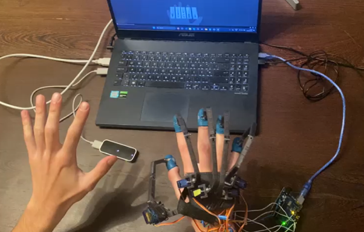
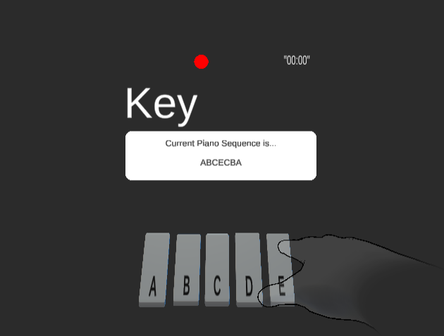
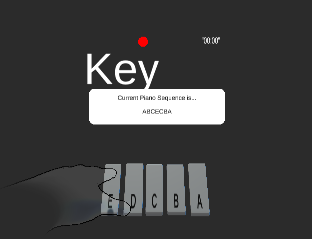
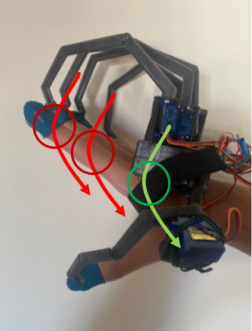

# STAR-eX: Student Teacher Assistive Rehabilitation Exoskeleton

## Introduction
This repository contains the code and documentation for the STAR-eX project (Student Teacher Assistive Rehabilitation Exoskeleton), inspired by Robotic Mirror Therapy (RMT), offering a cheap and portable alternative to other RMT devices on the market. The system combines a Leap Motion Controller, an Arduino-controlled 3D-printed parallel manipulator, and Unity to simulate and analyze hand movements while playing piano sequences. The primary goal of this project is to explore motor control and rehabilitation applications.

[Ultraleap Tracking Software](https://www.ultraleap.com) – Provides hand-tracking capabilities.

### System Overview

This project includes a Leap Motion Controller that tracks hand movements, a custom 3D-printed manipulator that moves the fingers, and Unity for simulation and testing purposes. The manipulator assists with both Active Mirror (AM) and Passive Mirror (P) conditions, as well as Kinesthetic (K) Therapy, offering a valuable tool for motor rehabilitation and control.

## Requirements
To set up and run this project, you will need the following components:

### Hardware
- **Leap Motion Controller** – A device that tracks hand motion.
- **3D-Printed Parallel Manipulator (RIGHT Hand)** – A robotic system to assist in finger movements. (Refer to the [GitHub repository](https://github.com/BerkeleyCurtis/EECS249_HapticGlove) for instructions.)
- **Arduino Uno** – Interfaces between the manipulator and Unity.
- **Servo Motors** – To drive the manipulator.
- **Small PCB** – To fit inside the robot's glove.
- **Wiring Cables** – To solder each Arduino to the PCB.
- **Variety of Custom Screws, Bolts, and Nuts** – For assembly.
- **Laptop/PC** – Must be capable of running Unity.

### Software
- **Ultraleap Tracking Software** – Provides hand-tracking capabilities.
- **Unity** – The game engine used for simulation.
- **Arduino IDE** – To upload and modify the Arduino control script.

## Functionality

### System Setup
1. Install **Ultraleap Tracking Software** and connect the Leap Motion Controller.
2. 3D-print and assemble the **RIGHT Hand** 3D-printed parts of the **Parallel Manipulator** (refer to the [GitHub repository](https://github.com/BerkeleyCurtis/EECS249_HapticGlove) for instructions). Assemble the servo motors and solder them to the PCB, then connect the Arduino accordingly.
3. Upload the appropriate **Arduino code**:
   - For the **Active Mirror (AM) Condition**, upload the AM code to the Arduino for **WarmUpLeft** or **P_Condition** scenes. Press "Enter" after playing the scene in Unity. *(Make sure the correct serial port is specified in `HandDataExtractor_P` on line 725)*
   - For the **Kinaesthetic (K) Condition**, upload the K Condition code to the Arduino.
4. Open Unity and ensure the serial connection to the Arduino is properly set up inside `HandDataExtractor_P` or `HandDataExtractor_K` in the "FlexionEditor" object of the scenes.
5. Run the Unity project.

### Unity Scenes
Across every scene, you will be able to play the piano. The thumb plays the **A key**, the index plays the **B key**, the middle finger plays the **C key**, and the pinky plays the **E key** for both the right and left hands. **NOTE:** It is impossible to play with the **ring finger** due to issues with Leap Motion tracking, so the **D key** will not be used in any sequences.

#### Warm-Up Right & Left
- **Warm-Up Right**: Allows playing the simple sequence **ABCE** using the right hand. Upon pressing enter, a terminal will show up with research-related questions. Refer to the **Research Purposes** section for more information.
  
  

- **Warm-Up Left**: Allows playing the same sequence using the left hand. You can either press **Backspace** or **Enter** to proceed. Pressing **Enter** will send information through the comlink.

  

#### Pre_Post_Test Scene
The **Pre-Post-Test** scene is similar to **Warm-Up Right**, but you can press **1, 2, 3, 4, or 5** to choose more challenging sequences.

#### P_Condition (Passive Mirror)
The **P_Condition** scene is inspired by **Mirror Therapy**, where the manipulator has no input, and you can press **Backspace** to continue without sending data. This condition focuses on rehabilitation and refining hand movements with no active control. However, if you press **Enter**, the **Active Mirror (AM) Mode** will activate, where the movements of the teacher's hand will be mirrored by the student's hand. In this mode, the manipulator will move the right hand accordingly to mirror the movements of the teacher's hand, creating a real-time interaction for both rehabilitation and motor control training.

This behavior is also verified in **Warm-Up Left**: You can press **Backspace** and simply play the piano sequence via the Leap Motion Controller, or press **Enter** to activate the **STAR-eX RMT Mode** and use the **AM Condition** Arduino code in conjunction with Unity's functionality to mirror the teacher's hand movements.

#### K_Condition (Kinaesthetic)
The **K_Condition** scene does **not** require the Leap Motion Controller. However, you must upload the **K Condition code** to the Arduino. In this scene, you should keep your hand as inert as possible, allowing the manipulator to move your fingers for you. This condition is inspired by **Robotic Therapy**, where the robot does everything for you, and you provide no input.

## How to Play Piano
- **Finger Movement**: The fingers should flex only at the **metacarpophalangeal joints** (knuckles), keeping the rest of the fingers stiff.
- **Thumb Movement**: The thumb should be moved primarily at the **distal joint (near the nail)**.
- **Precision**: The Leap Motion Controller's tracking is imperfect, so subtle and controlled movements are required.

## Research Purposes
This project is designed to help understand if the system's RMT mode (AM stands for Active Mirror, P for Passive Mirror, and K for Kinaesthetic) aids in motor skill acquisition and control refinement, and if it can assist with motor rehabilitation. The project will collect data on hand movements during piano sequences, and the following information will be requested at the start of the **Pre-Post Test** scene:
- Participant ID
- Test type (Pre/Post)
- Experimental condition

The collected joint angle data will be stored in a folder for analysis, and a `report.pdf` summarizing the results is available in the repository.

---
By following this README, you should be able to set up, run, and understand the full functionality of the STAR-eX project. For further details, refer to the documentation inside the repository.
